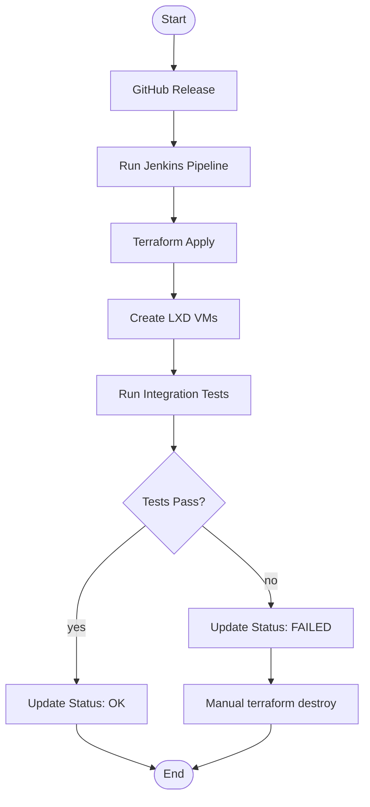

# LXD Virtual Machine Infrastructure with Terraform - System Architecture

## SysML Activity Diagram

```
                            ┌─────────────────────┐
                            │    [Start]          │
                            │   GitHub Release    │
                            └──────────┬──────────┘
                                       │
                                       ▼
                            ┌─────────────────────┐
                            │  (Jenkins Pipeline) │
                            │    Run Terraform    │
                            └──────────┬──────────┘
                                       │
                                       ▼
                            ┌─────────────────────┐
                            │  (Terraform Apply)  │
                            │  Provision LXD VMs  │
                            └──────────┬──────────┘
                                       │
                                       ▼
                            ┌─────────────────────┐
                            │  (LXD Daemon)       │
                            │  Creates VMs        │
                            └──────────┬──────────┘
                                       │
                                       ▼
                            ┌─────────────────────┐
                            │  (Run Tests)        │
                            │  Verify Deployment   │
                            └──────────┬──────────┘
                                       │
                              ┌────────┴────────┐
                              │   [Decision]    │
                              │   Tests Pass?   │
                              └────────┬────────┘
                            yes/        \no
                               /         \
                              ▼           ▼
                    ┌───────────┐   ┌───────────┐
                    │ [Action]  │   │ [Action]  │
                    │  Update   │   │  Update   │
                    │  Status:  │   │  Status:  │
                    │    OK     │   │  FAILED   │
                    └─────┬─────┘   └─────┬─────┘
                          │               │
                          │               ▼
                          │     ┌─────────────────┐
                          │     │  (Manual)       │
                          │     │  terraform      │
                          │     │  destroy        │
                          │     └────────┬────────┘
                          │              │
                          └──────┬───────┘
                                 │
                                 ▼
                         ┌───────────────┐
                         │    [End]      │
                         └───────────────┘
```

## SysML Activity Diagram (Mermaid)




## Component Requirements

### LXD Server (Daemon)

| Requirement | Description |
|-------------|-------------|
| **Host** | Linux server (physical/virtual) |
| **LXD Version** | 4.0+ |
| **Port** | 8443 (REST API) |
| **Network** | Accessible by Terraform host |
| **Authentication** | Certificate-based (trust password) |

### Terraform / LXD Provider

| Requirement | Description |
|-------------|-------------|
| **Terraform** | 1.0+ |
| **Provider** | `terraform-lxd/lxd` |
| **Network Access** | Must reach LXD daemon port 8443 |
| **Credentials** | LXD trust certificate |

### Jenkins

| Requirement | Description |
|-------------|-------------|
| **Plugins** | Pipeline, SSH Agent, Terraform, Git |
| **Credentials** | SSH private key, LXD certificates |
| **Webhook** | GitHub webhook trigger on release |
| **Agent** | Docker or SSH agent for running terraform |

## SysML Block Definition Diagram

```
╔══════════════════════════════════════════════════════════════════════════════════╗
║                            SYSML BLOCK DEFINITION                                ║
╠══════════════════════════════════════════════════════════════════════════════════╣
║  ┌─────────────────────┐                                                    ║
║  │    <<block>>        │                                                    ║
║  │   GitHubRelease     │                                                    ║
║  ├─────────────────────┤                                                    ║
║  │ + tag: String       │                                                    ║
║  │ + webhook_trigger   │                                                    ║
║  └──────────┬──────────┘                                                    ║
║             │ triggers (webhook)                                             ║
║             ▼                                                                ║
║  ┌─────────────────────┐                                                    ║
║  │    <<block>>        │                                                    ║
║  │   JenkinsPipeline   │                                                    ║
║  ├─────────────────────┤                                                    ║
║  │ + runTerraform()    │                                                    ║
║  │ + runTests()        │                                                    ║
║  └──────────┬──────────┘                                                    ║
║             │ executes                                                       ║
║             ▼                                                                ║
║  ┌─────────────────────┐     ┌─────────────────────┐                       ║
║  │    <<block>>        │     │    <<block>>        │                       ║
║  │    Terraform        │     │  Terraform LXD      │                       ║
║  │    Configuration    │     │    Provider         │                       ║
║  ├─────────────────────┤     ├─────────────────────┤                       ║
║  │ + provider: LXD     │     │ + endpoint: String  │                       ║
║  │ + lxd_instance      │────▶│ + config: Dict       │                       ║
║  └──────────┬──────────┘     └──────────┬──────────┘                       ║
║             │                             │                                   ║
║             │    REST API                 │ connects                         ║
║             │     (8443)                  ▼                                   ║
║             │                     ┌─────────────────────┐                    ║
║             │                     │    <<block>>        │                    ║
║             └───────────────────▶│    LXCDaemon       │                    ║
║                                   ├─────────────────────┤                    ║
║                                   │ + port: 8443       │                    ║
║                                   │ + certificates     │                    ║
║                                   │ + vms: List        │                    ║
║                                   └──────────┬──────────┘                    ║
║                                              │ manages                         ║
║                                              ▼                                ║
║                                   ┌─────────────────────┐                    ║
║                                   │  <<block>>          │                    ║
║                                   │  LXDVirtualMachine  │                    ║
║                                   ├─────────────────────┤                    ║
║                                   │ + name: String     │                    ║
║                                   │ + image: String    │                    ║
║                                   │ + type: vm         │                    ║
║                                   └─────────────────────┘                    ║
╚══════════════════════════════════════════════════════════════════════════════════╝
```

## SysML N-Square Diagram (Function-Component Allocation Matrix)

```
╔══════════════════════════════════════════════════════════════════════════════════════════════════╗
║                         N-SQUARE DIAGRAM: Function-Component Traceability                       ║
╠══════════════════════════════════════════════════════════════════════════════════════════════════╣
║                                                                                                  ║
║  Functions (↓) / Components (→) │ GitHub │ Jenkins │ Terraform │ LXD Prov │ LXD Daemon │ VMs  ║
║  ─────────────────────────────────────────┼────────┼─────────┼──────────┼──────────┼────────────┼─────║
║  1. Trigger Release                  │   X    │         │          │          │            │      ║
║  2. Run Pipeline                     │        │    X    │          │          │            │      ║
║  3. Terraform Init                   │        │         │    X     │          │            │      ║
║  4. Terraform Plan                   │        │         │    X     │          │            │      ║
║  5. Terraform Apply                  │        │         │    X     │    X     │            │      ║
║  6. Create Network                   │        │         │          │    X     │     X      │      ║
║  7. Create VMs                        │        │         │          │          │     X      │  X   ║
║  8. Install K3s                       │        │         │          │          │            │  X   ║
║  9. Run Tests                         │        │         │          │          │            │  X   ║
║  10. Report Status                    │        │    X    │          │          │            │      ║
║  11. Manual Cleanup                   │        │         │    X     │          │            │      ║
║                                                                                                  ║
╠══════════════════════════════════════════════════════════════════════════════════════════════════╣
║  Legend: X = implements/owns                                                              v1.0  ║
╚══════════════════════════════════════════════════════════════════════════════════════════════════╝
```

### Traceability Notes

- **GitHub**: Functions 1, 10 (Trigger, Status)
- **Jenkins Pipeline**: Functions 2, 10 (Run Pipeline, Report Status)
- **Terraform**: Functions 3, 4, 5, 11 (Init, Plan, Apply, Destroy)
- **LXD Provider**: Functions 5, 6 (Apply, Network)
- **LXD Daemon**: Functions 6, 7 (Network, VMs)
- **LXD VMs**: Functions 7, 8, 9 (Create, K3s, Tests)

## Example Jenkinsfile

```groovy
pipeline {
    agent any
    
    triggers {
        GenericTrigger(
            genericVariables: [
                [key: 'REF', value: '$.ref'],
                [key: 'ACTION', value: '$.action']
            ],
            causeString: 'Triggered by GitHub Release',
            token: 'lxc-terraform-pipeline'
        )
    }
    
    stages {
        stage('Terraform Init') {
            steps {
                dir('terraform') {
                    sh 'terraform init'
                }
            }
        }
        
        stage('Terraform Plan') {
            steps {
                dir('terraform') {
                    sh 'terraform plan -out=tfplan'
                }
            }
        }
        
        stage('Terraform Apply') {
            when {
                expression { env.ACTION == 'released' }
            }
            steps {
                dir('terraform') {
                    sh 'terraform apply -auto-approve tfplan'
                }
            }
        }
        
        stage('Run Tests') {
            steps {
                sh './test-vm.sh'
            }
        }
    }
}
```

## Example Terraform Configuration

```hcl
# LXD Provider Configuration
provider "lxd" {
  address = "https://192.168.1.100:8443"
  cert_file = "./lxd-cert.crt"
  key_file  = "./lxd-key.key"
}

# Virtual Machine Definition
resource "lxd_instance" "k3s_vm" {
  name      = "k3s-server"
  image     = "ubuntu/22.04"
  type      = "virtual-machine"
  ephemeral = false
  profiles  = ["default"]

  wait_for_network = true

  config = {
    "limits.cpu"    = "2"
    "limits.memory" = "4GB"
  }
}
```
