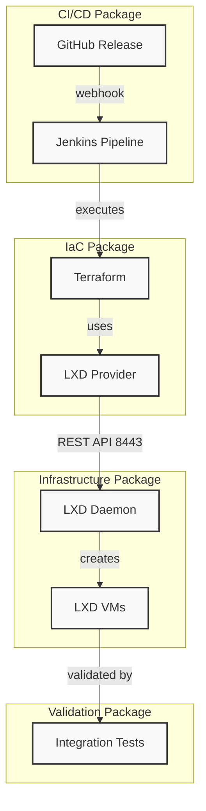

# LXD Virtual Machine Infrastructure with Terraform - System Architecture

## SysML Block Definition Diagram

```
┌─────────────────────────────────────────────────────────────────────────────┐
│                        INFRASTRUCTURE DOMAIN                                │
└─────────────────────────────────────────────────────────────────────────────┘
                                    │
                                    ▼
┌─────────────────────────────────────────────────────────────────────────────┐
│                           DEPLOYMENT FLOW                                   │
└─────────────────────────────────────────────────────────────────────────────┘

┌──────────────┐     ┌──────────────┐     ┌──────────────┐     ┌───────────┐
│   GitHub     │────▶│   Jenkins    │────▶│  Terraform   │────▶│   LXD     │
│   Release    │     │   Pipeline   │     │   Apply     │     │   Client  │
└──────────────┘     └──────────────┘     └──────────────┘     └─────┬─────┘
                                                                       │
                                    ┌──────────────────────────────────┘
                                    │
                                    ▼
                          ┌─────────────────────┐
                          │    LXD Daemon       │
                          │   (Server)          │
                          │  ┌─────────────┐    │
                          │  │  Port 8443  │    │
                          │  └─────────────┘    │
                           └─────────┬──────────┘
                                     │
                                     ▼
                           ┌─────────────────────┐
                           │  LXD Virtual        │
                           │  Machines           │
                           │  ┌───────────────┐  │
                           │  │  VM 1 (K3s)   │  │
                           │  │  VM 2 (K3s)   │  │
                           │  │  VM N (K3s)   │  │
                           │  └───────────────┘  │
                           └─────────────────────┘
                                     │
                                     ▼
                           ┌─────────────────────┐
                           │   Tests / Verify    │
                            └──────────┬──────────┘
                                       │
                     ┌─────────────────┴─────────────────┐
                     │                                   │
                     ▼                                   ▼
              ┌─────────────┐                   ┌─────────────┐
              │   Success   │                   │   Failure   │
              └──────┬──────┘                   └──────┬──────┘
                     │                                   │
                     ▼                                   ▼
              ┌─────────────┐                   ┌─────────────┐
              │  GitHub     │                   │  GitHub     │
              │  Status: OK │                   │  Status:    │
              └─────────────┘                   │  FAILED     │
                                                └──────┬──────┘
                                                       │
                                                       ▼
                                                ┌─────────────┐
                                                │ Manual       │
                                                │ terraform    │
                                                │ destroy      │
                                                └─────────────┘
```

## SysML Package Diagram



## Component Requirements

### LXD Server (Daemon)

| Requirement | Description |
|-------------|-------------|
| **Host** | Linux server (physical/virtual) |
| **LXD Version** | 4.0+ |
| **Port** | 8443 (REST API) |
| **Network** | Accessible by Terraform host |
| **Authentication** | Certificate-based (trust password) |

### Terraform / LXD Provider

| Requirement | Description |
|-------------|-------------|
| **Terraform** | 1.0+ |
| **Provider** | `terraform-lxd/lxd` |
| **Network Access** | Must reach LXD daemon port 8443 |
| **Credentials** | LXD trust certificate |

### Jenkins

| Requirement | Description |
|-------------|-------------|
| **Plugins** | Pipeline, SSH Agent, Terraform, Git |
| **Credentials** | SSH private key, LXD certificates |
| **Webhook** | GitHub webhook trigger on release |
| **Agent** | Docker or SSH agent for running terraform |

## Connection Flow Sequence

```
┌─────────┐     ┌──────────┐     ┌───────────┐     ┌────────┐     ┌─────────┐
│ GitHub  │────▶│  Jenkins │────▶│ Terraform │────▶│  LXD   │────▶│  Test   │
│ Release │     │ Pipeline │     │   Apply   │     │  API   │     │ Verify  │
└─────────┘     └──────────┘     └───────────┘     └────────┘     └────┬────┘
      ▲                                                             │
      │                                                             │
      │                    ┌────────────────────────────────────────┘
      │                    │
      │                    ▼                Failure Path
      │              ┌─────────────┐      (manual cleanup)
      │              │ GitHub      │◀────── terraform destroy
      │              │ Status:     │
      │              │ FAILED      │
      │              └──────┬──────┘
      │                     │
      └─────────────────────┘
           Notification
```
 
## Error Handling

On failure, the pipeline:
1. Reports status back to GitHub (FAILED)
2. Does NOT auto-rollback (VMs remain for debugging)
3. Manual cleanup required: `terraform destroy`

This approach allows inspection of failed VMs for debugging purposes.

## Example Jenkinsfile

```groovy
pipeline {
    agent any
    
    triggers {
        GenericTrigger(
            genericVariables: [
                [key: 'REF', value: '$.ref'],
                [key: 'ACTION', value: '$.action']
            ],
            causeString: 'Triggered by GitHub Release',
            token: 'lxc-terraform-pipeline'
        )
    }
    
    stages {
        stage('Terraform Init') {
            steps {
                dir('terraform') {
                    sh 'terraform init'
                }
            }
        }
        
        stage('Terraform Plan') {
            steps {
                dir('terraform') {
                    sh 'terraform plan -out=tfplan'
                }
            }
        }
        
        stage('Terraform Apply') {
            when {
                expression { env.ACTION == 'released' }
            }
            steps {
                dir('terraform') {
                    sh 'terraform apply -auto-approve tfplan'
                }
            }
        }
        
        stage('Run Tests') {
            steps {
                sh './test-vm.sh'
            }
        }
    }
}
```

## Example Terraform Configuration

```hcl
# LXD Provider Configuration
provider "lxd" {
  address = "https://192.168.1.100:8443"
  cert_file = "./lxd-cert.crt"
  key_file  = "./lxd-key.key"
}

# Virtual Machine Definition
resource "lxd_instance" "k3s_vm" {
  name      = "k3s-server"
  image     = "ubuntu/22.04"
  type      = "virtual-machine"
  ephemeral = false
  profiles  = ["default"]

  wait_for_network = true

  config = {
    "limits.cpu"    = "2"
    "limits.memory" = "4GB"
  }
}
```
