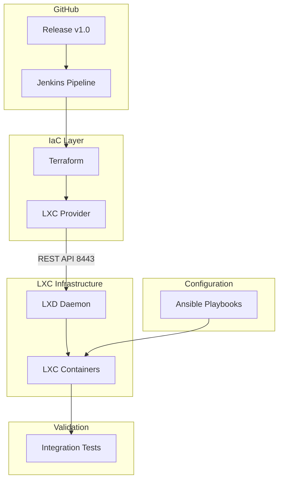

# LXC Infrastructure with Terraform - System Architecture

## SysML Block Definition Diagram

```
┌─────────────────────────────────────────────────────────────────────────────┐
│                        INFRASTRUCTURE DOMAIN                                │
└─────────────────────────────────────────────────────────────────────────────┘
                                    │
                                    ▼
┌─────────────────────────────────────────────────────────────────────────────┐
│                           DEPLOYMENT FLOW                                   │
└─────────────────────────────────────────────────────────────────────────────┘

┌──────────────┐     ┌──────────────┐     ┌──────────────┐     ┌───────────┐
│   GitHub     │────▶│   Jenkins    │────▶│  Terraform   │────▶│   LXC     │
│   Release    │     │   Pipeline   │     │   Apply     │     │   Client  │
└──────────────┘     └──────────────┘     └──────────────┘     └─────┬─────┘
                                                                       │
                                    ┌──────────────────────────────────┘
                                    │
                                    ▼
                          ┌─────────────────────┐
                          │    LXD Daemon       │
                          │   (Server)          │
                          │  ┌─────────────┐    │
                          │  │  Port 8443  │    │
                          │  └─────────────┘    │
                          └─────────┬──────────┘
                                    │
                                    ▼
                          ┌─────────────────────┐
                          │   LXC Containers   │
                          │  ┌───────────────┐  │
                          │  │ Container 1  │  │
                          │  │ Container 2  │  │
                          │  │ Container N  │  │
                          │  └───────────────┘  │
                          └─────────────────────┘
                                    │
                                    ▼
                          ┌─────────────────────┐
                          │     Ansible         │
                          │   Provisioning      │
                          └─────────┬──────────┘
                                    │
                                    ▼
                          ┌─────────────────────┐
                          │   Tests / Verify    │
                          └─────────────────────┘
```

## SysML Package Diagram



## SysML Block Definition (Detailed)

```
╔═══════════════════════════════════════════════════════════════════════════════╗
║                            SYSML BLOCK DEFINITION                            ║
╠═══════════════════════════════════════════════════════════════════════════════╣
║  ┌─────────────────────┐                                                    ║
║  │    <<block>>        │                                                    ║
║  │    GitHubRelease    │                                                    ║
║  ├─────────────────────┤                                                    ║
║  │ + tag: String       │                                                    ║
║  │ + webhook_trigger  │                                                    ║
║  └──────────┬──────────┘                                                    ║
║             │ triggers (webhook)                                            ║
║             ▼                                                                ║
║  ┌─────────────────────┐                                                    ║
║  │    <<block>>        │                                                    ║
║  │   JenkinsPipeline   │                                                    ║
║  ├─────────────────────┤                                                    ║
║  │ + runTerraform()    │                                                    ║
║  │ + runAnsible()      │                                                    ║
║  │ + runTests()        │                                                    ║
║  └──────────┬──────────┘                                                    ║
║             │ executes                                                       ║
║             ▼                                                                ║
║  ┌─────────────────────┐     ┌─────────────────────┐                       ║
║  │    <<block>>        │     │    <<block>>        │                       ║
║  │    Terraform        │     │    LXCClient        │                       ║
║  ├─────────────────────┤     ├─────────────────────┤                       ║
║  │ + provider: LXC     │     │ + endpoint: String  │                       ║
║  │ + lxc_container     │────▶│ + config: Dict      │                       ║
║  └──────────┬──────────┘     └──────────┬──────────┘                       ║
║             │                             │                                   ║
║             │    REST API                 │ connects                         ║
║             │     (8443)                  ▼                                   ║
║             │                     ┌─────────────────────┐                    ║
║             │                     │    <<block>>        │                    ║
║             └───────────────────▶│    LXDDaemon       │                    ║
║                                   ├─────────────────────┤                    ║
║                                   │ + port: 8443       │                    ║
║                                   │ + certificates     │                    ║
║                                   │ + containers: List  │                    ║
║                                   └──────────┬──────────┘                    ║
║                                              │ manages                         ║
║                                              ▼                                ║
║                                   ┌─────────────────────┐                    ║
║                                   │  <<block>>          │                    ║
║                                   │  LXCContainer       │                    ║
║                                   ├─────────────────────┤                    ║
║                                   │ + name: String      │                    ║
║                                   │ + image: String     │                    ║
║                                   │ + ephemeral: Bool  │                    ║
║                                   └─────────────────────┘                    ║
╚═══════════════════════════════════════════════════════════════════════════════╝
```

## Component Requirements

### LXD Server (Daemon)

| Requirement | Description |
|-------------|-------------|
| **Host** | Linux server (physical/virtual) |
| **LXD Version** | 4.0+ |
| **Port** | 8443 (REST API) |
| **Network** | Accessible by Terraform host |
| **Authentication** | Certificate-based (trust password) |

### LXC Client / Terraform

| Requirement | Description |
|-------------|-------------|
| **Terraform** | 1.0+ |
| **Provider** | `terraform-provider-lxc` or `terraform-provider-lxd` |
| **Network Access** | Must reach LXD daemon port 8443 |
| **Credentials** | LXD trust certificate |

### Ansible

| Requirement | Description |
|-------------|-------------|
| **Python** | 3.8+ on target containers |
| **SSH Access** | To provisioned containers |
| **Modules** | k8s, helm (for K8s workloads) |

### Jenkins

| Requirement | Description |
|-------------|-------------|
| **Plugins** | Pipeline, SSH Agent, Terraform, Git |
| **Credentials** | SSH private key, LXD certificates |
| **Webhook** | GitHub/GitLab webhook trigger on release |
| **Agent** | Docker or SSH agent for running terraform |

## Connection Flow Sequence

```
┌─────────┐     ┌──────────┐     ┌───────────┐     ┌────────┐     ┌─────────┐
│ GitHub  │────▶│  Jenkins │────▶│ Terraform │────▶│  LXD   │────▶│ Ansible │
│ Release │     │ Pipeline │     │   Plan    │     │  API   │     │ Deploy  │
└─────────┘     └──────────┘     └───────────┘     └────────┘     └─────────┘
     │               │                │                 │               │
     │               │                │                 │               │
     ▼               ▼                 ▼                 ▼               ▼
   Trigger        Run job         Provision          Create         Configure
   webhook        terraform       containers         containers     containers
```

## Example Jenkinsfile

```groovy
pipeline {
    agent any
    
    triggers {
        GenericTrigger(
            genericVariables: [
                [key: 'REF', value: '$.ref'],
                [key: 'ACTION', value: '$.action']
            ],
            causeString: 'Triggered by GitHub Release',
            token: 'lxc-terraform-pipeline'
        )
    }
    
    stages {
        stage('Terraform Init') {
            steps {
                dir('terraform') {
                    sh 'terraform init'
                }
            }
        }
        
        stage('Terraform Plan') {
            steps {
                dir('terraform') {
                    sh 'terraform plan -out=tfplan'
                }
            }
        }
        
        stage('Terraform Apply') {
            when {
                expression { env.ACTION == 'released' }
            }
            steps {
                dir('terraform') {
                    sh 'terraform apply -auto-approve tfplan'
                }
            }
        }
        
        stage('Ansible Provision') {
            steps {
                ansiblePlaybook(
                    playbook: 'site.yml',
                    inventory: 'site.yml',
                    credentialsId: 'ansible-ssh-key'
                )
            }
        }
        
        stage('Run Tests') {
            steps {
                sh './test-container.sh'
            }
        }
    }
}
```

## Example Terraform Configuration

```hcl
# LXC Provider Configuration
provider "lxc" {
  lxc_url = "https://192.168.1.100:8443"
  lxc_cert = "./lxd-cert.crt"
  lxc_key  = "./lxd-key.key"
}

# Container Definition
resource "lxc_container" "jenkins" {
  name        = "jenkins-server"
  image       = "ubuntu/22.04"
  ephemeral   = false
  start       = true

  config = {
    "security.nesting" = "true"
    "linux.kernel_modules" = "overlay,nf_conntrack"
  }

  devices = {
    root = {
      path = "/"
      type = "disk"
    }
  }
}
```
